# Complete Project Workflow - Simplified

## Single End-to-End Workflow Diagram

```mermaid
flowchart TD
    Start([User Opens App]) --> Home[Home Page<br/>Start Practice Session]
    
    Home --> SelectTopic[Select Discussion Topic<br/>Choose difficulty level]
    
    SelectTopic --> LoadModels[Load AI Models<br/>━━━━━━━━━━━━━━━<br/>• 4 LLMs Gemma/Mistral/LLaMA3/Phi3<br/>• Emotion CNN<br/>• MediaPipe Face Landmarker<br/>• Text LSTM optional]
    
    LoadModels --> StartDiscussion[Discussion Starts<br/>━━━━━━━━━━━━━━━<br/>Alexa welcomes user<br/>Timer begins]
    
    StartDiscussion --> UserInput{User Input Type?}
    
    UserInput -->|Text| TextPath[Type Message]
    UserInput -->|Voice| VoicePath[Speak via Microphone<br/>Web Speech API converts to text]
    UserInput -->|Camera| CameraPath[Enable Camera<br/>Continuous video analysis]
    
    TextPath --> ProcessMessage[Process User Message<br/>━━━━━━━━━━━━━━━━━━━━━]
    VoicePath --> ProcessMessage
    
    subgraph MessageProcessing["Message Analysis Pipeline"]
        ProcessMessage --> P1[1. Heuristic Analysis<br/>Word count, fillers, keywords]
        P1 --> P2[2. LSTM Scoring optional<br/>Confidence & fluency prediction]
        P2 --> P3[3. NLP Analysis<br/>Similarity, originality, coherence]
        P3 --> P4[4. Emotion Integration<br/>Apply emotion multipliers]
        P4 --> P5[5. Calculate Final Metrics<br/>15+ dimensions 0-100 scale]
    end
    
    subgraph CameraProcessing["Video Analysis Pipeline Every 200ms"]
        CameraPath --> C1[1. Capture Frame<br/>640×480 resolution]
        C1 --> C2[2. Face Detection<br/>BlazeFace finds face]
        C2 --> C3[3. Emotion Recognition<br/>CNN predicts 6 emotions]
        C2 --> C4[4. Landmark Detection<br/>MediaPipe 468 points]
        C3 --> C5[5. Multi-Modal Fusion<br/>CNN×0.7 + MediaPipe×0.3]
        C4 --> C5
        C5 --> C6[6. Update Emotion Overlay<br/>Show bars & percentages]
        C6 --> C7[7. Send to Metrics<br/>Influence confidence score]
    end
    
    P5 --> UpdateUI[Update Real-Time UI<br/>━━━━━━━━━━━━━━━━━━━━━<br/>• Animated metric bars<br/>• Score badges<br/>• Emotion display<br/>• WPM, filler count]
    
    C7 --> UpdateUI
    
    UpdateUI --> BotTurn[Bot Response Generation<br/>━━━━━━━━━━━━━━━━━━━━━━━]
    
    subgraph BotResponse["Bot Response Pipeline"]
        BotTurn --> B1[1. Select Next Bot<br/>Round-robin: Alexa→Maya→Sarah→Momo]
        B1 --> B2[2. Build Prompt<br/>System + Context + User message]
        B2 --> B3{3. Ollama Available?}
        B3 -->|Yes| B4[LLM Generation<br/>Contextual response 1-2s]
        B3 -->|No| B5[Fallback Response<br/>Pre-defined contextual reply]
        B4 --> B6[4. Clean & Format Response]
        B5 --> B6
        B6 --> B7[5. Display in Chat<br/>Add bot message]
        B7 --> B8[6. Text-to-Speech<br/>Bot speaks with unique voice]
    end
    
    B8 --> Continue{Continue<br/>Discussion?}
    
    Continue -->|Yes| UserInput
    
    Continue -->|No| EndDiscussion[User Clicks End Discussion<br/>━━━━━━━━━━━━━━━━━━━━━━━━━<br/>Stop all services]
    
    EndDiscussion --> GenerateReport[Generate Performance Report<br/>━━━━━━━━━━━━━━━━━━━━━━━━━━━]
    
    subgraph ReportGeneration["Report Generation"]
        GenerateReport --> R1[1. Collect All Data<br/>Final metrics, history, messages]
        R1 --> R2[2. Calculate Overall Score<br/>Core×70% + Support×30%]
        R2 --> R3[3. Identify Strengths<br/>Metrics ≥ 75]
        R3 --> R4[4. Identify Weaknesses<br/>Metrics < 65]
        R4 --> R5[5. Generate Improvements<br/>YouTube links, tips, papers]
        R5 --> R6[6. Create Charts<br/>Time-series SVG graphs]
    end
    
    R6 --> ShowReport[Display Report Page<br/>━━━━━━━━━━━━━━━━━━━━━<br/>• Overall score badge<br/>• Performance breakdown<br/>• Strengths & weaknesses<br/>• Improvement recommendations<br/>• Interactive charts]
    
    ShowReport --> Export{Export Report?}
    
    Export -->|PDF| ExportPDF[Generate PDF<br/>html2canvas + jsPDF]
    Export -->|HTML| ExportHTML[Generate HTML<br/>Standalone file]
    Export -->|No| End
    
    ExportPDF --> End([Session Complete])
    ExportHTML --> End
    
    style Start fill:#4ecdc4,stroke:#333,stroke-width:2px
    style End fill:#95e1d3,stroke:#333,stroke-width:2px
    style MessageProcessing fill:#e3f2fd,stroke:#1976d2,stroke-width:2px
    style CameraProcessing fill:#fff3e0,stroke:#f57c00,stroke-width:2px
    style BotResponse fill:#f3e5f5,stroke:#7b1fa2,stroke-width:2px
    style ReportGeneration fill:#e8f5e9,stroke:#388e3c,stroke-width:2px
    style UpdateUI fill:#fff9c4,stroke:#f57f17,stroke-width:2px
    style ShowReport fill:#c8e6c9,stroke:#388e3c,stroke-width:2px
```



## Key Components Summary

### **Input Layer**
- 📝 Text typing
- 🎤 Voice (Web Speech API)
- 📹 Camera (MediaPipe + CNN)

### **AI Models (7 Total)**
1. **Gemma** - Alexa bot (analytical)
2. **Mistral** - Maya bot (encouraging)
3. **LLaMA 3** - Sarah bot (facilitative)
4. **Phi-3** - Momo bot (evaluative)
5. **Emotion CNN** - 6-class facial emotion
6. **MediaPipe** - 468 facial landmarks
7. **Text LSTM** - Confidence & fluency (optional)

### **Processing Pipeline**
1. User input → Analysis (heuristic + ML)
2. Camera → Emotion detection (every 200ms)
3. Multi-modal fusion → Final metrics
4. Bot selection → LLM generation
5. Response → Text-to-speech

### **Output Layer**
- ⚡ Real-time metrics (15+ dimensions)
- 💬 AI bot responses with TTS
- 📊 Comprehensive report with charts
- 📄 PDF/HTML export

### **Data Flow**
```
User → Input Processing → ML Models → Fusion → Metrics → UI
                                    ↓
                              Bot Response → TTS → User
```

---

## Simplified Text Description

**Step-by-step:**

1. **Start** → User opens app, clicks "Start Practice Session"
2. **Setup** → Select topic, load AI models (4 LLMs + vision models)
3. **Discussion Loop:**
   - User types/speaks message
   - System analyzes: heuristics + LSTM + NLP
   - Camera analyzes: face detection + emotion CNN + MediaPipe
   - Fusion combines all signals → 15+ metrics updated
   - Bot responds using LLM (or fallback)
   - Bot speaks via text-to-speech
   - Repeat until user ends
4. **Report** → Calculate overall score, identify strengths/weaknesses
5. **Export** → Generate PDF/HTML report
6. **Done** → User can review and download

**Core Innovation:** Multi-modal (text + audio + video) + Multi-LLM (4 personalities) = Comprehensive real-time assessment

---

## One-Sentence Summary

**"User discusses with 4 AI bots while the system analyzes their text, voice, and facial expressions in real-time using 7 deep learning models to provide comprehensive skill assessment."**
